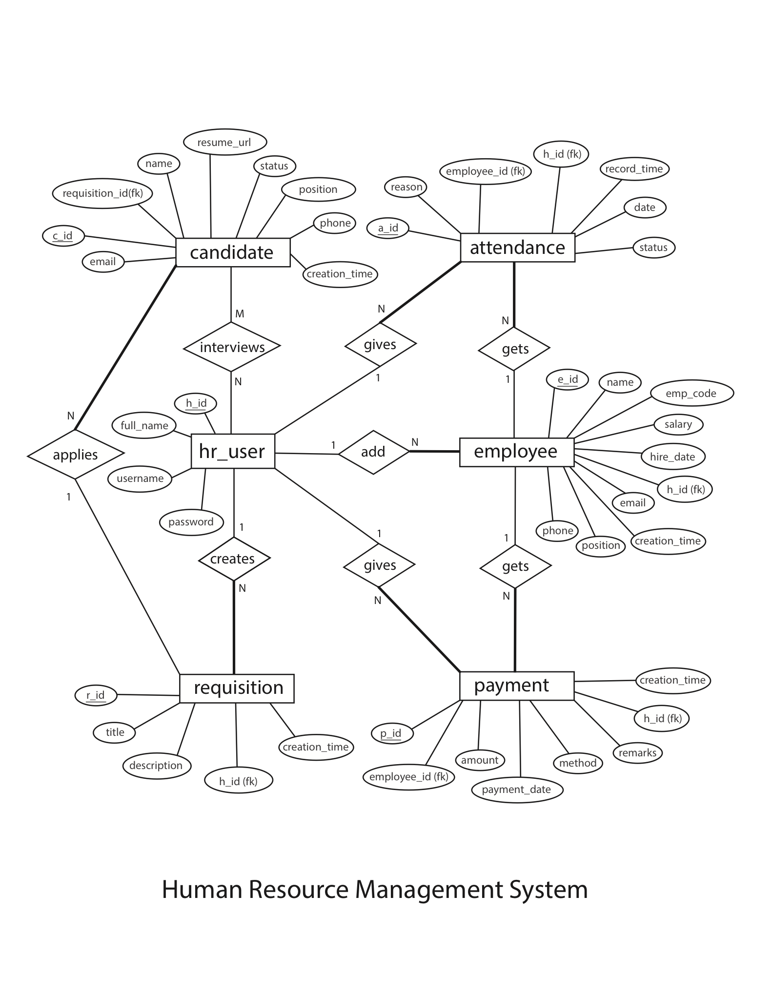

<div align="center">

# 🏢 Human Resource Management System (HRMS)

**A comprehensive, database-driven web application built with Spring Boot, Thymeleaf, and MySQL for enterprise workforce and talent lifecycle management.**

[](https://www.oracle.com/java/)
[](https://spring.io/projects/spring-boot)
[](https://www.mysql.com/)
[](https://www.thymeleaf.org/)
[](https://www.docker.com/)
[](https://render.com)

[Live Demo](#-deploying-live-on-render-free) • [Key Features](#-core-features--modules) • [Database Architecture](#-database-architecture--er-diagram) • [Quick Start](#-quick-start--local-setup) • [Cloud Deployment](#-deploying-live-on-render-free)

</div>

---

## 📌 Overview

**HRMS** is a full-stack Database Management System (DBMS) project designed to streamline end-to-end human resource operations. It simplifies employee records management, recruitment pipelines, attendance monitoring, payroll processing, and regulatory document exports (PDF & Excel).

### Why HRMS?
- **Unified Portal:** Centralizes HR workflows into an intuitive, responsive dashboard.
- **Relational Integrity:** Implements robust database constraints, foreign keys, cascade deletes, and indexing.
- **Instant Reporting:** Generates dynamic Excel spreadsheets and PDF audit reports on demand.
- **Cloud Ready:** Containerized with Docker and ready for 1-click cloud deployment.

---

## ✨ Core Features & Modules

```
 ┌─────────────────────────────────────────────────────────────┐
 │                      HRMS DASHBOARD                         │
 ├──────────────┬──────────────┬──────────────┬────────────────┤
 │ 👥 EMPLOYEES │ 🎯 RECRUIT   │ ⏱️ ATTENDANCE│ 💳 PAYROLL     │
 │ • CRUD & Info│ • Job Posts  │ • Daily Log  │ • Salaries     │
 │ • Search     │ • Candidates │ • Bulk Entry │ • Receipts     │
 │ • Export Doc │ • Status Flow│ • Reports    │ • History      │
 └──────────────┴──────────────┴──────────────┴────────────────┘
```

### 1. 🔐 Authentication & Session Security
- Secure session-based HR administrator login.
- Protected route interception via `AuthInterceptor`.
- Multi-user HR account management.

### 2. 👥 Employee Management
- Complete Employee Lifecycle CRUD (Create, View, Update, Terminate/Delete).
- Unique Employee Code generation and duplicate-check validation.
- Real-time keyword search across names, positions, codes, and emails.
- One-click **Export to Excel (`.xlsx`)** and **Export to PDF (`.pdf`)**.

### 3. 🎯 Recruitment & Talent Pipeline
- **Job Requisitions:** Create, publish, and manage hiring demands.
- **Candidate Tracking:** Track applicants linked directly to specific requisitions with status progression (`APPLIED`, `INTERVIEW`, `SHORTLISTED`, `HIRED`, `REJECTED`).
- Resume URL linkage and applicant contact profiles.

### 4. ⏱️ Attendance Management
- Daily clock-in/attendance recording with status tags (`Present`, `Absent`, `Late`).
- **Bulk Attendance Entry:** Mark attendance for the whole workforce in a single click.
- Automated date stamping and employee association.

### 5. 💳 Payroll & Salary Disbursements
- Record and process employee salary disbursements and bonuses.
- Multi-channel payment method tracking (Bank Transfer, Cash, Cheque, Online).
- Payment ledger with timestamping, remarks, and employee payroll history.

### 6. 📄 Document & Report Generation
- **Excel Export:** Automated multi-column spreadsheet generation using **Apache POI**.
- **PDF Export:** Clean tabular PDF summaries using **OpenPDF / LibrePDF**.

---

## 🏗 Database Architecture & ER Diagram

> **Faculty-Reviewed ER Design:** The Entity-Relationship (ER) diagram below represents the system's conceptual and relational data architecture using Chen's notation. It has been verified and approved as part of the Database Management Systems (DBMS) curriculum.

<div align="center">
  <a href="docs/erd-hrms.pdf" target="_blank">
    
  </a>
  <p><em>Official HRMS Entity-Relationship (ER) Conceptual Design (Chen's Notation)</em></p>
  <p>
    <a href="docs/erd-hrms.pdf"><strong>📄 Download / View High-Resolution Vector PDF</strong></a>
  </p>
</div>

### Relational Schema Summary
- **`hr_user`** (`h_id` [PK], `username`, `password`, `full_name`)
- **`employee`** (`e_id` [PK], `emp_code`, `name`, `email`, `phone`, `position`, `hire_date`, `salary`, `creation_time`, `h_id` [FK])
- **`requisition`** (`r_id` [PK], `title`, `description`, `h_id` [FK], `creation_time`)
- **`candidate`** (`c_id` [PK], `requisition_id` [FK], `name`, `email`, `phone`, `resume_url`, `status`, `position`, `creation_time`)
- **`attendance`** (`a_id` [PK], `employee_id` [FK], `h_id` [FK], `date`, `status`, `reason`, `record_time`)
- **`payment`** (`p_id` [PK], `employee_id` [FK], `h_id` [FK], `amount`, `payment_date`, `method`, `remarks`, `creation_time`)

---

## 🛠 Tech Stack

| Layer | Technologies |
| :--- | :--- |
| **Backend** | Java 21 LTS, Spring Boot 4.0 (Spring MVC, Spring Data JPA, Hibernate) |
| **Frontend** | Thymeleaf Template Engine, HTML5, CSS3, Bootstrap, Responsive Layouts |
| **Database** | MySQL 8.0 / MariaDB (JDBC, Connection Pooling) |
| **Reporting** | Apache POI (Excel `.xlsx`), OpenPDF (PDF Generation) |
| **Tooling & Build** | Maven, Lombok, Git |
| **DevOps & Cloud** | Docker (Multi-stage Build), Render / Railway Cloud Hosting |

---

## 🚀 Quick Start & Local Setup

### Prerequisites
- [Java JDK 17+](https://adoptium.net/) (Java 21 recommended)
- [MySQL Server 8.0+](https://dev.mysql.com/downloads/mysql/)
- [Git](https://git-scm.com/)
- [Maven](https://maven.apache.org/) *(Optional, Maven Wrapper `./mvnw` is included)*

---

### Step 1: Clone Repository
```bash
git clone https://github.com/m-k-julkarnain/hrms.git
cd hrms
```

---

### Step 2: Set Up Database

1. Open your MySQL client (MySQL Workbench, DBeaver, or Terminal CLI) and run [`database.sql`](database.sql):
```bash
mysql -u root -p < database.sql
```
*(Or create a database named `hrms` and the tables will be initialized automatically on startup via Hibernate)*.

2. Verify or configure your database credentials in [`src/main/resources/application.properties`](src/main/resources/application.properties):
```properties
spring.datasource.url=jdbc:mysql://localhost:3306/hrms?useSSL=false&allowPublicKeyRetrieval=true&serverTimezone=UTC
spring.datasource.username=root
spring.datasource.password=YOUR_MYSQL_PASSWORD
```

---

### Step 3: Run the Application

Using Maven wrapper:
```bash
# macOS / Linux
./mvnw spring-boot:run

# Windows
mvnw.cmd spring-boot:run
```

The application will start on: **`http://localhost:8080`**

---

### 🔑 Default Demo Credentials

| Role | Username | Password |
| :--- | :--- | :--- |
| **HR Administrator** | `admin` | `password123` |

---

## 🐳 Running with Docker

You can build and run HRMS in an isolated container without needing Java installed on your machine:

```bash
# 1. Build Docker Image
docker build -t hrms-app .

# 2. Run Container (connecting to host MySQL or cloud DB)
docker run -p 8080:8080 \
  -e SPRING_DATASOURCE_URL="jdbc:mysql://host.docker.internal:3306/hrms?useSSL=false&allowPublicKeyRetrieval=true&serverTimezone=UTC" \
  -e SPRING_DATASOURCE_USERNAME="root" \
  -e SPRING_DATASOURCE_PASSWORD="YOUR_PASSWORD" \
  hrms-app
```

---

## 🌐 Deploying Live on Render (100% Free)

You can host HRMS online 24/7 with a free public URL on **[Render](https://render.com)**.

### Step 1: Get a Free Cloud MySQL Database
Render provides free PostgreSQL, while HRMS uses MySQL. You can get a free, hosted MySQL database in under 60 seconds from:
- **[Aiven.io](https://aiven.io/)** (Free MySQL instance)
- **[TiDB Cloud](https://tidbcloud.com/)** (Free Serverless MySQL)
- **[Clever Cloud](https://www.clever-cloud.com/)** (Free MySQL add-on)

1. Create a free MySQL database on any of the providers above.
2. Run the queries from [`database.sql`](database.sql) to seed default data.
3. Copy the **Host, Port, Database Name, User, and Password**.

---

### Step 2: Deploy to Render

1. Sign in to **[Render.com](https://dashboard.render.com/)** and click **New +** → **Web Service**.
2. Connect your GitHub repository: `m-k-julkarnain/hrms`.
3. Select **Docker** environment (Render will automatically detect the [`Dockerfile`](Dockerfile)).
4. Under **Environment Variables**, add:

| Key | Example Value |
| :--- | :--- |
| `SPRING_DATASOURCE_URL` | `jdbc:mysql://YOUR_DB_HOST:PORT/hrms?useSSL=true&serverTimezone=UTC` |
| `SPRING_DATASOURCE_USERNAME` | `YOUR_DB_USER` |
| `SPRING_DATASOURCE_PASSWORD` | `YOUR_DB_PASSWORD` |
| `SPRING_JPA_HIBERNATE_DDL_AUTO` | `update` |
| `PORT` | `8080` |

5. Click **Deploy Web Service**! Render will build the container and provide you with a live `https://hrms-xxxx.onrender.com` link.

---

## 📁 Project Structure

```
hrms/
├── Dockerfile                      # Cloud containerization build configuration
├── render.yaml                     # Render deployment blueprint
├── database.sql                    # Complete MySQL schema & initial seed data
├── pom.xml                         # Maven project dependencies & build plugins
├── src/
│   ├── main/
│   │   ├── java/com/dbms/hrms/
│   │   │   ├── HrmsApplication.java       # Spring Boot Application entrypoint
│   │   │   ├── config/                    # MVC & Exception Handler configuration
│   │   │   ├── controller/                # Spring MVC Controllers (Routing & Actions)
│   │   │   ├── model/                     # JPA Entities (Employee, Candidate, Attendance, etc.)
│   │   │   ├── repository/                # Spring Data JPA Repository Interfaces
│   │   │   ├── security/                  # Authentication Interceptor & Session guard
│   │   │   └── util/                      # Excel & PDF Export Utility helpers
│   │   └── resources/
│   │       ├── application.properties     # Application configuration & datasource
│   │       ├── static/css/                # Bootstrap styles & custom stylesheets
│   │       └── templates/                 # Thymeleaf HTML views & layouts
│   └── test/                              # Unit & integration test suites
└── README.md                       # Project documentation
```

---

## 👨‍💻 Author

**M K Julkarnain**  
- **GitHub:** [@m-k-julkarnain](https://github.com/m-k-julkarnain)  
- **Project:** Human Resource Management System (HRMS) — DBMS Course Project

---

## 📄 License

This project is licensed under the **MIT License** — feel free to use and customize it for learning, academic, and portfolio demonstrations.
